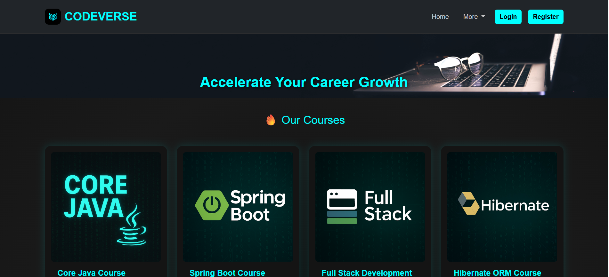

# 💻 CodeVerse

CodeVerse is a full-stack web application built using **Spring Boot**, **Thymeleaf**, and **MySQL**. It provides a platform for users to explore and enroll in programming courses, with secure user registration, login, and **integrated payment functionality via Razorpay**.

---

## 📸 Screenshots

| Home Page | All Courses |
|-----------|-------------|
|  |  |

> 💡 Place your screenshots inside the `/screenshots/` folder in your project directory.

---

## 🎥 Live Demo

[](https://youtu.be/OkFit0MDbsY)

---

## ⚙️ Tech Stack

- **Backend**: Spring Boot, Spring MVC, Spring Data JPA  
- **Frontend**: Thymeleaf, Bootstrap 5  
- **Database**: MySQL  
- **Build Tool**: Maven  
- **IDE**: Spring Tool Suite (STS)  
- **Payment Integration**: Razorpay

---

## 🚀 Features

- 🔐 User registration and login with Spring Security
- 🎓 Course listing and course details
- 💳 Razorpay Payment Gateway Integration
- 👤 Role-based UI (Admin & User)
- 📦 Clean MVC architecture
- 📂 Modular folder structure
- 📄 Thymeleaf templating for frontend

---

## 📦 Folder Structure (Brief)
CodeVerse
├── src
│ ├── main
│ │ ├── java/com/codeverse/...
│ │ └── resources/
│ │ ├── templates/
│ │ └── static/
│ └── test
├── screenshots/
├── pom.xml
└── README.md

## 🛠️ How to Run the Project

1. Clone the repo:
   ```bash
   git clone https://github.com/RakshitDev/CodeVerse.git
Import the project in STS as a Maven project

Create a MySQL DB named codeverse_db
Update credentials in application.properties

Run the CodeVerseApplication.java main class

Open browser:

arduino
Copy
Edit
http://localhost:8080

## 🛠️ How to Run the Project

1. Clone the repo:
   ```bash
   git clone https://github.com/RakshitDev/CodeVerse.git
Import the project in STS as a Maven project

Create a MySQL DB named codeverse_db
Update credentials in application.properties

Run the CodeVerseApplication.java main class

Open browser:


Copy
Edit
http://localhost:8080

🔗 Connect with Me
📧 rbalagundi@gmail.com

